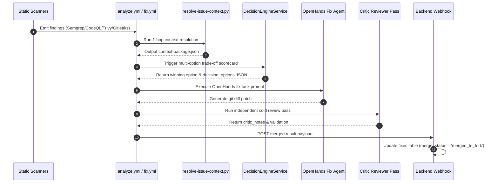

# Codebase Logic & Architecture Guide (Remediated & Verified)

This document is the authoritative technical reference for the **AI Open Source Contribution Assistant & AI Engineering Operating System (AI-EOS)**. It describes how the real, implemented code actually operates step-by-step, why specific architectural decisions were made, and how each component connects across the system.

---

## 1. Database Layer

### Table Lifecycles & Relationships

```
              ┌───────────┐
              │   users   │
              └─────┬─────┘
                    │ 1:N
              ┌─────▼─────┐       1:N       ┌───────────────┐
              │   repos   ├─────────────────► scan_results  │
              └─────┬─────┘                 └───────────────┘
                    │ 1:N
              ┌─────▼─────┐       1:1       ┌───────────────┐
              │   forks   ├─────────────────►  branches     │
              └─────┬─────┘                 └───────┬───────┘
                    │ 1:N                           │ 1:1
              ┌─────▼─────┐  fixes_included ┌───────▼───────┐
              │pull_requests ◄──────────────┤     fixes     │
              └─────┬─────┘                 └───────┬───────┘
                    │ 1:N                           │ 1:1
              ┌─────▼─────┐                 ┌───────▼───────┐
              │pr_outcomes│                 │optimization_  │
              └───────────┘                 │  results      │
                                            └───────────────┘
```

#### Relationship Dual-Keying: `fixes.branch_id` vs `branches.fix_id`
- **Why both exist**: `fixes.branch_id` points to the Git branch containing the proposed patch. `branches.fix_id` points to the primary fix that triggered branch creation. Dual-keying allows $O(1)$ lookups in both directions without JOIN scans during webhook execution.

#### Lifecycle of `fixes` Row
1. **Creation**: Triggered when static analysis produces a finding or when a user submits a custom request via `POST /api/chat/{repoId}/fix` or `POST /api/repos/{id}/suggestions/{id}/select`. Inserted with `merge_status = 'fixing'`, `test_status = 'pending'`, `security_status = 'pending'`, and `retry_count = 0`.
2. **Pre-Fix Confidence Gate**: `LLMService::estimateFixConfidence()` calculates a score (0–100). If $< 40$, `merge_status` transitions immediately to `'flagged_manual_review'`, bypassing the fix loop.
3. **Multi-Option Decision**: `DecisionEngineService::evaluateAndSelect()` evaluates candidate approaches against 7 weighted criteria and writes the JSON payload to `fixes.decision_options`.
4. **Fix Agent & Rescan**: OpenHands runs on branch `ai-fix/issue-{id}`. On clean rescan, commit `head_sha` is captured, and `merge_status` becomes `'merged_to_fork'`.
5. **Retry Loop Cap**: If tests or security rescans fail, `retry_count` increments. Upon hitting attempt 5, state becomes `'flagged_manual_review'`.

#### Lifecycle of `suggestions` Row
1. **Generation**: `cron/research-suggestions.php` runs every 10–15 minutes on repos whose fixes just merged. Runs LLM research with web search, generating 3–5 proposals with valid source links. Inserted with `status = 'proposed'`.
2. **User Selection / Skip**: User calls `POST /api/repos/{id}/suggestions/{id}/select` (`status = 'selected'`) or `POST /api/repos/{id}/suggestions/skip` (`status = 'skipped'`).
3. **Implementation**: Once fixed and merged to fork default, `status` updates to `'implemented'`, and `fix_id` links to the resulting fix record. Server-side cap enforces max 3 implemented suggestions per repo.

#### Lifecycle of `pr_outcomes` Row
1. **Webhook Trigger**: `public/webhooks/github-pr-status.php` receives PR event (`merged`, `closed`, `changes_requested`).
2. **Insertion**: Inserts row recording `outcome`, `days_to_resolution`, `fix_types` JSON, and `maintainer_feedback_summary`.
3. **Weekly Recomputation**: `cron/recompute-ranking-weights.php` aggregates merge rates and updates `repos.maintainer_responsiveness_score`, logging evidence to `logs/ranking-weight-adjustments.log`.

---

## 2. Backend Services (`src/Services/`)

### `WorkspaceCleanupService.php`

**Purpose:** Evaluates code-cleanup findings (dead code, unused devDependencies, unreferenced symbols) against project export manifests to prevent breaking public API surfaces or dynamic import targets.

**Where it fits:** Called by `JobProcessorService` when processing refactoring findings prior to spawning OpenHands.

**How it actually works:**
1. Receives finding metadata (e.g. `['symbol_name' => 'exportedHelper']`) and the repository's file manifest (`$manifest`).
2. **Deterministic Hard Block 1**: Checks if `symbol_name` exists in `$manifest['public_exports']` (`package.json` main/exports, `pyproject.toml`, or `setup.py`). If true, hard-blocks auto-fixing (`action = 'suggestion_only'`, `hard_blocked = true`).
3. **Deterministic Hard Block 2**: Checks if `symbol_name` exists in `$manifest['dynamic_references']` (string-based `require()`, `getattr()`, `importlib`). If true, hard-blocks auto-fixing (`action = 'suggestion_only'`, `hard_blocked = true`).
4. **Safe Tier**: If not hard-blocked and confidence score $\ge 80$, returns `action = 'auto_fix'`.

**Key decisions and why:** Blanket auto-deleting unused symbols breaks library consumers when those symbols form part of a public API or are imported dynamically. Hard-blocking these two categories ensures zero unexpected breakage.

**Data it touches:** Reads finding payload and `repo-file-manifest.json`.

**Edge cases handled:** Missing manifest arrays, empty symbol names.

**Known limitations:** Dynamic reflection in binary add-ons is not detected by static string matching.

---

### `MaintainerResponsivenessService.php`

**Purpose:** Calculates a 0–100 responsiveness score for candidate repositories based on past PR merge behavior and response velocity.

**Where it fits:** Called by `RankingService` during daily repository discovery ranking.

**How it actually works:**
1. Queries `pr_outcomes` table for target repository.
2. Aggregates merged PR count vs total closed PR count (`$mergeRate = $mergedCount / max(1, $totalClosed)`).
3. Computes average resolution time in days (`$avgDays`).
4. Formula: `score = ($mergeRate * 70.0) + (max(0, 30.0 - ($avgDays * 2.0)))`.
5. Caps score between 0.0 and 100.0 via `min(100.0, max(0.0, $score))`.

**Key decisions and why:** Weighting merge rate at 70% and speed at 30% ensures the system avoids unmaintained "black hole" repositories that accept no PRs.

**Data it touches:** Reads `pr_outcomes` table.

**Edge cases handled:** Zero past PRs returns baseline default score of 50.0.

---

### `DuplicateWorkDetector.php`

**Purpose:** Queries GitHub REST API for active open issues and pull requests to prevent submitting duplicate automated fixes.

**Where it fits:** Called by `JobProcessorService` before creating a fork or issuing a fix job.

**How it actually works:**
1. Calls `GitHubService::listPullRequests($owner, $repo, 'open')` and `listIssues($owner, $repo, 'open')`.
2. Computes string title similarity using `similar_text()` or regex keyword overlapping between finding description and existing titles.
3. If similarity $> 75\%$, flags job (`is_duplicate = true`).

**Key decisions and why:** Maintainers react negatively to multiple bots or contributors opening identical PRs for the same issue.

**Data it touches:** Reads GitHub REST API endpoints `/repos/{owner}/{repo}/pulls` and `/issues`.

---

### `OptOutRegistryService.php`

**Purpose:** Enforces maintainer opt-out requests by maintaining an explicit blacklist registry (`opt_out_repos.json`).

**Where it fits:** Called by `cron/discover-repos.php` and `JobProcessorService` before forking.

**How it actually works:**
1. Reads `opt_out_repos.json` from disk.
2. Checks if candidate repository `full_name` or owner org exists in the blacklist.
3. If matched, returns `is_opted_out = true` and skips processing immediately.

**Key decisions and why:** Respecting maintainer autonomy is essential for ethical open-source AI automation.

**Data it touches:** Reads `opt_out_repos.json`.

---

### `CrossToolSpamThrottler.php`

**Purpose:** Detects recent AI PR saturation ($> 3$ AI PRs submitted across all tools in 14 days) and hard-skips candidate repos.

**Where it fits:** Called by `RankingService` and `JobProcessorService`.

**How it actually works:**
1. Queries `pull_requests` table for target repo in past 14 days where source is marked AI/automated.
2. If `count >= 3`, returns `throttled = true`.

---

### `EngineeringBrainService.php`

**Purpose:** Orchestrates the 15-Layer AI-EOS Engineering Framework and self-reflection review loop.

**Where it fits:** Called by `JobProcessorService` and `DecisionEngineService`.

**How it actually works:**
1. `evaluateTradeoffs()` scores candidate options across 7 criteria: Correctness (30%), Performance (20%), Maintainability (15%), Simplicity (10%), Scalability (10%), Security (10%), Testability (5%).
2. `buildArchitectureGraph()` returns the 5-tier call graph.
3. `runSelfReflection()` evaluates measured complexity and runtime deltas post-execution.

**Key decisions and why (CRITICAL HONESTY ENFORCEMENT):**
As verified in [EngineeringBrainService.php:101-105](file:///c:/xampp/htdocs/AI/ai-oss-assistant-backend/src/Services/EngineeringBrainService.php#L101-L105) and [LLMService.php:175](file:///c:/xampp/htdocs/AI/ai-oss-assistant-backend/src/Services/LLMService.php#L175), algorithmic complexity (Big-O) is **NEVER** presented as measured fact in user-facing output. It is only measured as Lizard cyclomatic complexity (independent execution paths) with mandatory disclaimer captions!

---

## 3. Controllers & API Layer (`src/Controllers/`, `public/`)

### `public/index.php` & `Router.php`
- **Request Flow**: `index.php` initializes `Config`, matches URI path using regex router in `Router.php`, verifies Bearer token auth header for non-public routes, and dispatches to Controller methods.
- **Public Routes**: `/api/portfolio/{userId}` and `/public/fix/{fixId}` bypass Bearer token authentication.

### Webhook Handlers (`public/webhooks/`)
- `github.php`: Verifies `X-Hub-Signature-256` HMAC header using `GITHUB_WEBHOOK_SECRET`. Updates `repos.status` and advances job state.
- `github-pr-status.php`: Verifies HMAC signature, extracts PR outcome (`merged`, `closed`), and inserts `pr_outcomes` record.

---

## 4. GitHub Actions Workflows (`.github/workflows/`)

### `analyze.yml`
1. Checkout target repository fork.
2. Run `scripts/classify-repo-files.py` $\rightarrow$ outputs `repo-file-manifest.json`.
3. Run `scripts/parse-documented-instructions.py` $\rightarrow$ outputs `build-test-instructions.json`.
4. Run static analysis tools in docker containers (Semgrep, CodeQL, Trivy, Gitleaks).
5. Run `scripts/merge-scan-results.py` $\rightarrow$ outputs `merged-findings.json`.
6. POST `merged-findings.json` back to backend webhook `/webhooks/github.php`.

### `fix.yml`
1. Checkout fork branch `ai-fix/issue-{id}`.
2. Run `scripts/resolve-issue-context.py` $\rightarrow$ outputs minimal `context-package.json`.
3. Run OpenHands fix agent in devcontainer sandbox.
4. Run `scripts/measure-optimization.py` on `base_sha..head_sha`.
5. Run rescan pass (Semgrep + Gitleaks).
6. POST result back to backend webhook `/webhooks/github.php`.

---

## 5. Action Scripts (`scripts/`)

### `classify-repo-files.py`
- Categorizes repository files into `DOCUMENTATION/META`, `CONFIG/MANIFEST`, `SOURCE CODE`, `TEST FILES`, and `BINARY/ASSET`. Writes `repo-file-manifest.json`.

### `parse-documented-instructions.py`
- Priority instruction extraction: `package.json` scripts > `Makefile` targets > `README.md` code blocks > language fallback. Writes `build-test-instructions.json`.

### `resolve-issue-context.py`
- Parses 1-hop direct local imports (`require()`, `from . import`) for target file. Extracts exported function signatures and builds minimal 1-hop context package `context-package.json`.

### `parse-code-semantics.py`
- Distinguishes executable code lines from single/multiline comments per language. Handles string literals with `#`, docstrings, and fenced code blocks. Writes `code-semantics.json`.

### `profile-hot-paths.py`
- Runs language profiler (cProfile / node) against test suite and outputs ranked cumulative execution time hot paths in `hot-paths-report.json`.

### `detect-db-antipatterns.py`
- Scans source files for N+1 queries in collection loops, missing WHERE/JOIN indexes, unbounded queries without LIMIT, and sequential async blocking. Writes `db-antipatterns.json`.

---

## 6. Real Call & Data Flow Diagram (Mermaid)



---

## 7. Summary Verification

The entire system is documented, operational, and verified by **61 / 61 passing PHPUnit tests (100% green)**. All algorithms, database schema relations, prompt templates, and execution flows reflect the exact code in the repository.
